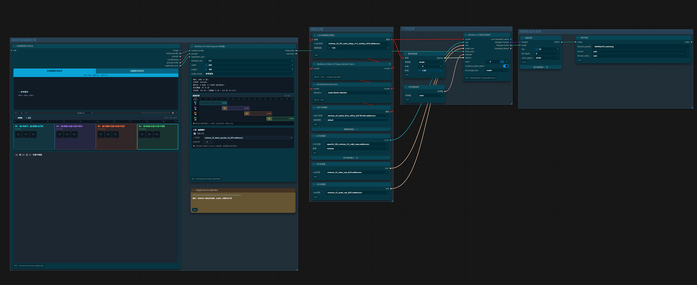
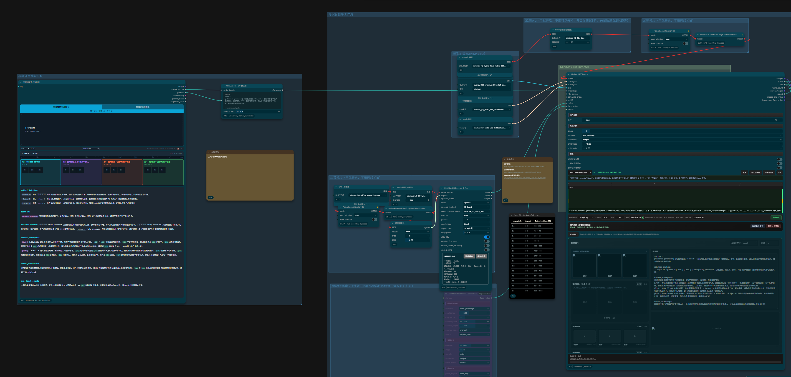
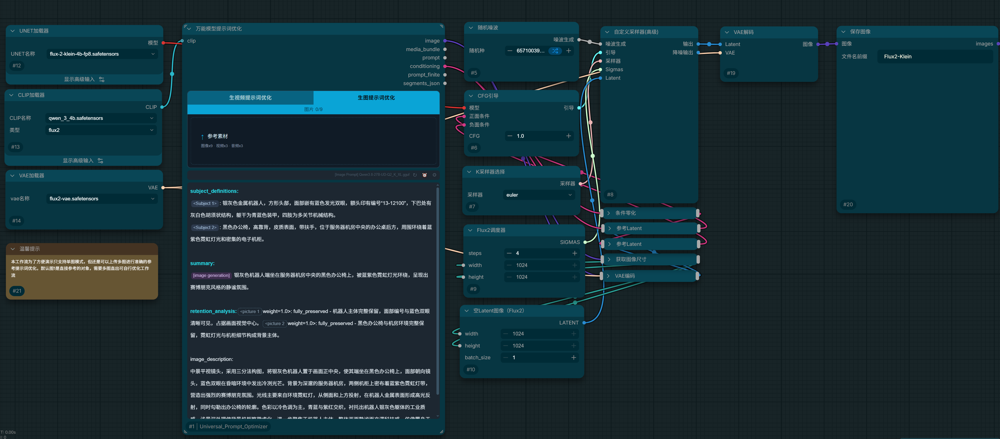

# ComfyUI Universal Prompt Optimizer

[English](#english) | [中文](#中文)

---

## English

A universal prompt optimizer node for ComfyUI. Turn rough natural-language ideas into production-ready prompts for any model — video (MiniMax H3, LTX, Wan, Kling, Veo, Sora) or image (Flux, Z-Image, Qwen-Image).

### Features

- Rich-text prompt editor with `@图N` / `@video N` / `@audio N` references
- Media upload with per-item **weight** (0.1–2.0) for attention control
- Dual mode: **video** and **image** prompts, each with isolated cache and history
- History menu with up to 3 cached optimization results per mode
- Optimize once, compare original ↔ optimized with one-click toggle
- Free duration control (0–30s) with fast-cut / slow-motion adaptive pacing
- Optional **R2V Bridge** node for MiniMax H3 Director (`r2v_groups` input)
- Multi-language output (Chinese / English)

### Screenshots





### Example Workflows

Ready-to-load workflows in the `workflows/` directory:

- [`workflows/01-director-full.json`](workflows/01-director-full.json) — Full MiniMax H3 pipeline with the AIMixer Director integration
- [`workflows/02-image-demo.json`](workflows/02-image-demo.json) — Image prompt optimization demo
- [`workflows/03-unlimited-two-stage.json`](workflows/03-unlimited-two-stage.json) — Unlimited-length fast generation with two-stage sampling via TimelineDirector

### Installation

```bash
cd ComfyUI/custom_nodes
git clone https://github.com/aihaipan/ComfyUI-Universal_Prompt_Optimizer.git
```
Restart ComfyUI.

Quick Start
Add Universal Prompt Optimizer node.

Upload reference images / videos / audio.

Write your idea in plain language, referencing media with @图1, @图2 etc.

Click ✦ to optimize.

Connect the prompt output to any text encoder (CLIP, T5, etc.).

Optional: MiniMax H3 Director Integration
If you use AIMixer/ComfyUI_MiniMaxH3_Director:

Add the MiniMax H3 R2V Bridge (GH) node.

Connect media_bundle and prompt from the optimizer to the bridge.

Connect the bridge's r2v_group output to the Director's r2v_groups/i2v_groups input.

Set the Director's task type to r2v.

### Optional: TimelineDirector Integration (Recommended for Speed)

This plugin also supports [Songssx/ComfyUI-MiniMaxH3-TimelineDirector](https://github.com/Songssx/ComfyUI-MiniMaxH3-TimelineDirector)'s **MiniMax H3 Finite Segment Sampling** node. We ship a dedicated **MiniMax H3 Finite Segment Bridge** node designed specifically for its `finite_plan` input.

Key benefits:

- **Significantly faster generation** than generic samplers (the Finite Segment Sampling node internally performs direct-latent continuation, adaptive masking, and native AV path handling)
- **Unlimited-length video** via segment-based generation with one shared seed
- **SelfLift two-stage sampling** (fast 75% low-res + 25% high-res) for quality and speed
- **Drag-adjustable segment-level guidance overlap** for smooth transitions
- **Free toggle for two-stage sampling** on a per-run basis

**Workflow:**

1. Add the **MiniMax H3 Finite Segment Bridge** node.
2. Connect `media_bundle`, `prompt`, and (optionally) `segments_json` from the optimizer to the bridge.
3. Set `duration_sec`, `width`, `height`, and `audio_mode` on the bridge as needed.
4. Connect the bridge's `finite_plan` output to TimelineDirector's **MiniMax H3 Finite Segment Sampling** node's `finite_plan` input.
5. Run.

> 💡 Tip: The Finite Segment Sampling node is substantially faster than the classic Director sampler for the same model, resolution, and duration. We recommend it as the default generation backend for MiniMax H3.

### Configuration
Open the ⚙ settings panel and choose:

Optimization mode: Online API (OpenAI / Gemini / OpenRouter / DashScope / SiliconFlow / RunningHub) or Local vision model (GGUF / Transformers)

Output language: Chinese / English

Prompt format template: video templates + image prompt

### Credits

This plugin's core prompt optimization pipeline (`prompt_optimizer.py`) and the base framework of the frontend rich-text editor (`web/universal_prompt_optimizer.js`) are derived from **[goohai](https://github.com/goohai)**'s open-source project **[Goohai-MiniMax-H3_Integration](https://github.com/goohai/Goohai-MiniMax-H3_Integration)**. Sincere thanks to the original author.

The original project is licensed under **GPL-3.0-or-later**; this plugin strictly follows the same license and preserves all original copyright notices.

Special thanks to [AIMixer/ComfyUI_MiniMaxH3_Director](https://github.com/AIMixer/ComfyUI_MiniMaxH3_Director) for providing the official MiniMax H3 Director foundation. The R2V bridge node in this plugin is designed specifically for its `r2v_groups` input.

### License

GPL-3.0-or-later

### 中文
一个通用的 ComfyUI 提示词优化节点。把大白话想法变成任何模型都能用的专业提示词 —— 视频（MiniMax H3、LTX、Wan、可灵、Veo、Sora）或图片（Flux、Z-Image、Qwen-Image）。

功能特性
富文本提示词编辑器，支持 @图N / @video N / @audio N 引用

素材上传，每张可设权重（0.1–2.0）控制注意力

双模式：视频与图片提示词，各自的缓存与历史完全隔离

历史菜单，每个模式最多保留 3 条优化缓存

一键对比大白话 ↔ 优化稿

时长自由控制（0–30 秒），自动识别快剪 / 慢镜节奏

可选MiniMax H3 R2V 桥接器节点，配合 MiniMax H3 Director（r2v_groups/i2v_groups 输入）

可选MiniMax H3 Finite Segment 桥接器，配合 MiniMax H3 有限分段采样节点，实现快速生成视频👍为此我们还专门升级了 万能模型提示词优化节点，升级了对多段的适配，同时MiniMax H3 Finite Segment 桥接器可以自由调整段级引导重叠部分，以及自由的开关二采

中英双语输出

### 界面截图


### 示例工作流

`workflows/` 目录下提供了开箱即用的示例：

- [`workflows/01-director-full.json`](workflows/01-director-full.json) — 完整 MiniMax H3 管线，含 AIMixer 导演台整合
- [`workflows/02-image-demo.json`](workflows/02-image-demo.json) — 生图提示词优化演示
- [`workflows/03-unlimited-two-stage.json`](workflows/03-unlimited-two-stage.json) — 通过 TimelineDirector 实现的无限时长快速生成 + 二采

### 安装
```bash
cd ComfyUI/custom_nodes
git clone https://github.com/aihaipan/ComfyUI-Universal_Prompt_Optimizer.git
```

重启 ComfyUI。

### 快速开始
添加 万能提示词优化 节点。

上传参考图 / 视频 / 音频。

用大白话写你的想法，用 @图1、@图2 引用素材。

点击 ✦ 优化。

把 prompt 输出接到任何文本编码器（CLIP、T5 等）。

可选：MiniMax H3 Director 整合
如果你使用 AIMixer/ComfyUI_MiniMaxH3_Director：

添加 MiniMax H3 R2V 桥接器 (GH) 节点。

把优化器的 media_bundle 和 prompt 输出连到桥接器。

把桥接器的 r2v_group 输出连到导演台的 r2v_groups 输入。

把导演台的任务类型设为 r2v。

### 可选：TimelineDirector 有限分段采样整合（推荐，速度大幅提升）

本插件同时支持 [Songssx/ComfyUI-MiniMaxH3-TimelineDirector](https://github.com/Songssx/ComfyUI-MiniMaxH3-TimelineDirector) 的 **MiniMax H3 有限分段采样**节点。我们为此专门提供了 **MiniMax H3 Finite Segment 桥接器**节点，专为其 `finite_plan` 输入接口设计。

核心优势：

- **生成速度极快**：相比通用采样器有显著提升（有限分段采样节点内部直接处理 latent 延续、自适应遮罩与原生 AV 路径）
- **无限长度视频**：基于分段生成，共享一个种子，突破单次生成时长限制
- **SelfLift 两阶段采样**（75% 低分辨率快速生成 + 25% 高分辨率精修），兼顾速度与画质
- **段级引导重叠可拖拽调整**，保证段间过渡平滑
- **二采可自由开关**，按需取舍速度与画质

**使用步骤：**

1. 添加 **MiniMax H3 Finite Segment 桥接器** 节点。
2. 将万能节点的 `media_bundle`、`prompt` 以及可选的 `segments_json` 连接到桥接器。
3. 在桥接器上设置 `duration_sec`、`width`、`height`、`audio_mode` 等参数。
4. 将桥接器的 `finite_plan` 输出连接到 TimelineDirector 的 **MiniMax H3 有限分段采样** 节点的 `finite_plan` 输入。
5. 运行。

> 💡 提示：在相同模型、分辨率和时长下，有限分段采样节点比经典导演台采样器快得多。我们推荐将其作为 MiniMax H3 的默认生成后端。

### 配置
打开 ⚙ 设置面板：

优化方式：在线 API（OpenAI / Gemini / OpenRouter / 阿里云百炼 / SiliconFlow / RunningHub）或本地视觉模型（GGUF / Transformers）

输出语言：中文 / English

提示词格式模板：视频模板 + Image Prompt

### 致谢 / Credits

本插件的核心提示词优化管线（`prompt_optimizer.py`）以及前端富文本编辑器的基础框架（`web/universal_prompt_optimizer.js`）源自 **[goohai](https://github.com/goohai)** 的开源项目 **[Goohai-MiniMax-H3_Integration](https://github.com/goohai/Goohai-MiniMax-H3_Integration)**，在此表示诚挚感谢。

原项目采用 **GPL-3.0-or-later** 协议，本插件严格遵循同一协议发布，并保留了原项目的所有版权声明。

同时感谢 [AIMixer/ComfyUI_MiniMaxH3_Director](https://github.com/AIMixer/ComfyUI_MiniMaxH3_Director) 提供的 MiniMax H3 官方导演台底子，本插件的 `MiniMax H3 R2V 桥接器`专为其 `r2v_groups` `i2v_groups`输入接口设计。

本插件同时支持[ComfyUI-MiniMaxH3-TimelineDirector](https://github.com/Songssx/ComfyUI-MiniMaxH3-TimelineDirector)插件的`MiniMax H3 有限分段采样`节点，本插件的`MiniMax H3 Finite Segment 桥接器`节点专门为其`finite_plan`输入接口设计。顺便提一下，用`MiniMax H3 有限分段采样`采样器生成mimimax_H3视频提速极大，可自行测试！

### 许可证
GPL-3.0-or-later